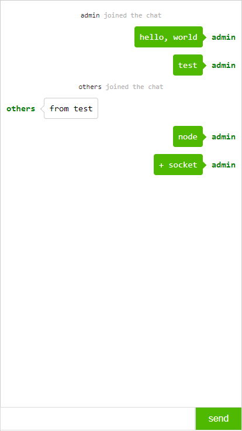
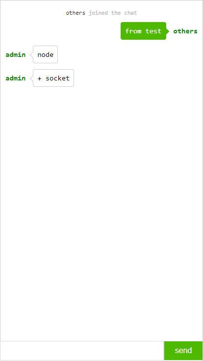

# node-chat
一个在线聊天的项目, node+socket

运行步骤
- 安装`node`环境
- `npm install --save express`
- `npm install --save socket.io`
- 修改`server.js`里的`ip`地址
- 执行命令`node server.js`

目录结构
-- public  js，css等文件夹
-- index.html  主入口文件
-- login.html  登录，注册页面
-- server.js  服务文件

1. 登录的时候选择名字，然后起一个随机码，作为key
2. 用这个key作为文件夹名字存放聊天记录
3. 读取和写入
4. 支持加载更多